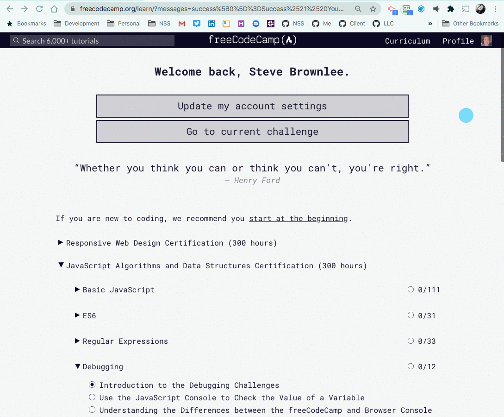

<nav>
    <ul class="list list--books">
        <li class="left">
            Previous: <a href="../">Welcome</a>
        </li>
        <li class="right">
            Next: <a href="../book-2-the-invisible-web">Book 2 - The Invisible Web</a>
        </li>
    </ul>
</nav>

# Book 1 - Software Installations and Accounts

In this book, you will learn the basics of using your computer and using your keyboard. These are crucial to start with because you will be typing more than you ever have before (unless you're a novelist), and being comfortable with using keyboard shortcuts and navigating your operating system will save you a tremendous amount of time while you are coding.

## Setting up Mac OS

If you have a Mac, follow the instructions in the following three chapters.

<ul class="list">
    <li class="listItem">
        
Part 1

        <a href="./chapters/GETTING_STARTED_MAC.html">Installations for Mac</a>
    </li>
    <li class="listItem">
        
Part 2

        <a href="./chapters/RUNNING_APPS_MAC.html">Starting Applications on Mac</a>
    </li>
    <li class="listItem">
        
Part 3

        <a href="./chapters/APP_TAB_SWITCHING_MAC.html">Using the Keyboard for Mac</a>
    </li>
</ul>

## Setting up Windows

If you have a Windows machine, follow the instructions in the following three chapters.

<ul class="list">
    <li class="listItem">
        
Part 1

        <a href="./chapters/GETTING_STARTED_WINDOWS.html">Installations for Windows</a>
    </li>
    <li class="listItem">
        
Part 2

        <a href="./chapters/RUNNING_APPS_WINDOWS.html">Starting Applications on Windows</a>
    </li>
    <li class="listItem">
        
Part 3

        <a href="./chapters/APP_TAB_SWITCHING_WINDOWS.html">Using the Keyboard for Windows</a>
    </li>
</ul>

## Create Required Accounts

### Codecademy

1. Register with [Codecademy](https://www.codecademy.com/register)
1. Make sure that your profile is publicly accessible. The animation below shows you how to do that.

### FreeCodeCamp

1. Register with [FreeCodeCamp](https://www.freecodecamp.org/).
1. Make sure that the information on your profile is publicly accessible. The animation below shows you how to do that.

### Provide Your Profile URLs

Once you have created your accounts, share your account URL with us. Just click this **large, blue** button to send them.

    <a class="button blue"
       href="https://forms.gle/ZattQJCXHpeAzGmG9"
       target="_blank">Send my Free Resource Profiles to NSS</a>

## Next: JavaScript and the Invisible Web

Now that you have access to the free material, it is time to start practicing JavaScript. You will spend at least 90% of your time in the first three months trying to gain proficiency in JavaScript, so it is the most crucial part of the Foundations Course.

<a href="../book-2-the-invisible-web">Go to Book 2 - The Invisible Web</a>

 
 
 

---

## Related Links

<ul>
    <li>
        <a href="../">Welcome</a>
    </li>
    <li>
        <a href="../book-2-the-invisible-web/">Book 2 - The Invisible Web</a>
    </li>
    <li>
        <a href="../book-3-the-visible-web/">Book 3 - The Visible Web</a>
    </li>
    <li>
        <a href="../book-4-terminal-velocity/">Book 4 - Terminal Velocity</a>
    </li>
</ul>
