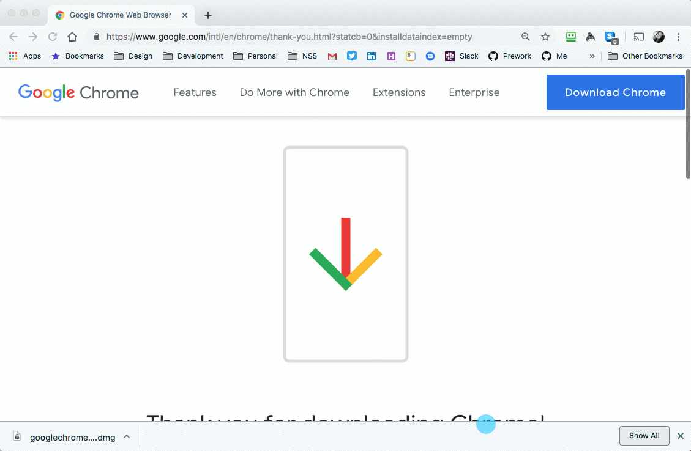

[Welcome](../../) > [Book 1 - Getting Started](../README.md) > Mac Installations

# Getting Started

First, you need to install some tools that you will be using both for the Foundations Course and for your time at Nashville Software School.

If you have never installed software before on your Mac, once you download the installer and run it, you are usually presented with a window that asks you to click and drag the program into the Applications folder. You need to do that to ensure that it is installed correctly.

## Google Chrome

[Google Chrome](https://www.google.com/chrome/browser/desktop/index.html) is the most popular browser for web developers because of the powerful tools it provides to test code, manipulate documents, and measure performance.

## Visual Studio Code

Visual Studio Code is the editor we will all be working on to start the course. To install it, visit the [Visual Studio Code website](https://code.visualstudio.com) and click the big blue button that says **Download Mac Universal**.

## Rectangle

This application will allow you to use certain combinations of keys on your keyboard to move and resize applications while you are developing.

[Download and install Rectangle](https://www.rectangleapp.com/) and after it is installed, open the application to try it out.

## Install Slack (Accepted Students Only)

> **Note:** Only install this tool if/when you are accepted to NSS

Our main way of communicating with students is a tool called Slack. [Download and install the application](https://slack.com/downloads/mac) now. Our admissions team will send you an email inviting you to join. Be on the lookout for that email. When you receive your invitation from admissions, join the Nashville Software School Slack immediately, and make sure you join your cohort channel.

When you create your Slack account, you must:

1. Use your real name.
1. Add a picture so we can recognize you.
