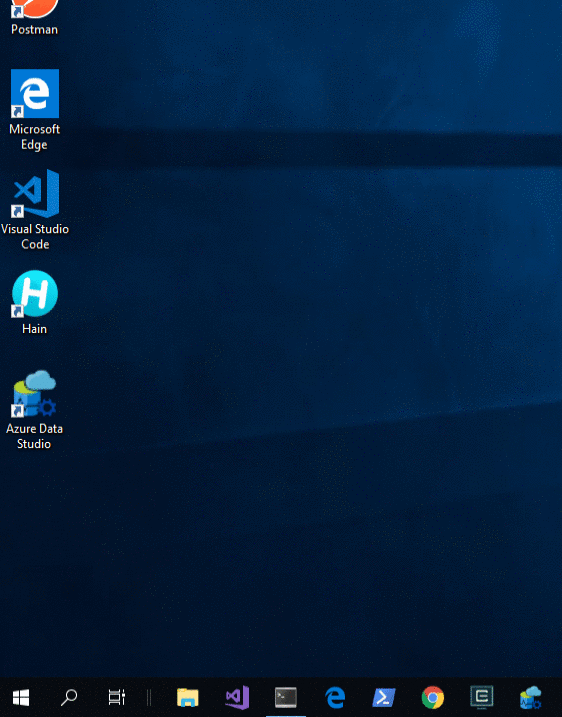

[Welcome](https://nashville-software-school.github.io/prework/) > [Book 1 - Getting Started](../README.md) > Running Applications on Windows

# Starting Applications on Windows

## Clicking Start

If you have used Windows before, you likely know that you can click the Windows start button in the lower left corner of the screen to show applications that ou have installed.

## Windows Key

You can also press the Windows key next to the spacebar on your keyboard, and it will automatically show the start menu.

## Finding Your App

Sometimes the application you want to run doesn't show in the Start menu. That's ok, because once the start menu appears, you can simply start typing in the name of the application that you want to run and a list of matching applications will appear in a list as you type.

## Trying it Out

> **IMPORTANT:** For the remainder of the Foundations Course, when you see the words "terminal" or "command line", it means Git Bash for Windows users.

1. Use the Search to launch Google Chrome (use "chrome" to search)
1. Use the Search to launch Visual Studio Code (use "code" to search)
1. Use the Search to launch your terminal (use "bash" to search and open Git Bash)

## Advanced: Spotlight for Windows

If you have been a Mac user in the past, and Windows is new to you, and you want to use something like Spotlight on Windows, you can install an application named [Hain](https://github.com/hainproject/hain) that provides that functionality.

WARNING: The steps for installing Hain are very technical, so if you visit the docs and are overwhelmed, wait until you start the course and the instruction team can help.

