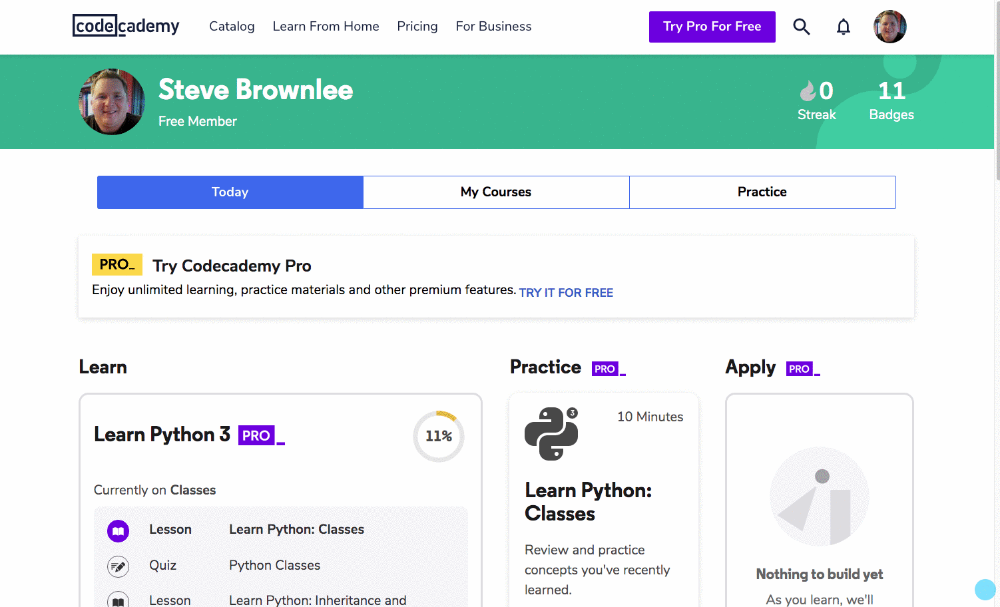

<nav>
    <ul class="list list--books">
        <li class="left">
            Previous: <a href="../book-1-your-computer">Book 1 - Your Computer</a>
        </li>
        <li class="right">
            Next: <a href="../book-3-the-visible-web">Book 3 - The Visible Web</a>
        </li>
    </ul>
</nav>

# Before You Start

You must to create accounts on the completely free resources that you will be using during the Foundations Course.

1. Register with [Codecademy](https://www.codecademy.com/register)
1. Register with [repl.it](https://repl.it/signup)

Once you have created your accounts, you must share them with us. Just click this **large, blue** button to send them.

    <a class="button blue"
       href="https://docs.google.com/forms/d/e/1FAIpQLScTx65ruOT4f6SDAnmTvcU1M2KZv_6fGsVXDxxOaGkUj9xnhQ/viewform?usp=sf_link"
       target="_blank">Send my Free Resource Profiles to NSS</a>

> **Important:** After you create your Codecademy account, make sure that your profile is publicly accessible.

# Book 2 - The Invisible Web

In this book, you will learn some fundamental concepts and skills in writing the logic and operations that power modern websites in the JavaScript language. The first three months at Nashville Software School focuses almost exclusively on building applications for the browser with JavaScript.

Making as much progress on JavaScript is **critical** to your success early in the course.

<ul class="list list--doubleItems">
    <li class="listItem listItem--doubleItems">
        
Part 1

        
The content and exercises in this part will introduce you to the fundamental syntax of using variables and values in a software language.

        <a target="_blank" href="https://repl.it/classroom/invite/l7DkvOG">Introduction to JavaScript Variables</a>
    </li>
    <li class="listItem listItem--doubleItems">
        
Part 2

        
Next up is arrays. An array is a structure in JavaScript that lets you store multiple values together in a single collection.

        <a target="_blank" href="https://repl.it/classroom/invite/lgDSk7q">Introduction to JavaScript Arrays</a>
    </li>
</ul>

<ul class="list list--doubleItems">
    <li class="listItem listItem--doubleItems">
        
Part 3

        
An object is another structure that software developers use to represent the real-world things that they write software to automate - people, cars, toys, processes, etc.

        <a target="_blank" href="https://repl.it/classroom/invite/lrD8rDV">Introduction to JavaScript Objects</a>
    </li>
    <li class="listItem listItem--doubleItems">
        
Part 4

        
Software developers use functions to break down a complex series of steps into fine-grained tasks that should be completed in a specific order.

        <a target="_blank" href="https://repl.it/classroom/invite/rCn7VuV">Introduction to JavaScript Functions</a>

    </li>
</ul>

<ul class="list list--doubleItems">
    <li class="listItem listItem--doubleItems">
        
Part 5

        
Now go to the Codecademy platform that take their introduction to JavaScript course. You only need to work through chapters 1-8 in the free tier material.

        <a target="_blank" href="https://www.codecademy.com/learn/introduction-to-javascript">Codecademy - Intro To JavaScript</a>
    </li>
    <li class="listItem listItem--doubleItems">
        
Part 6

        
Now that you have done some introductory exercises about variables and <strong>if/then</strong> statements, it's time to practice those concepts.

        <a target="_blank" href="https://repl.it/classroom/invite/WM91h85">Practice Conditional Logic</a>
    </li>
</ul>

<ul class="list list--doubleItems">
    <li class="listItem listItem--doubleItems">
        
Part 7

        
Next, practice putting multiple values into arrays and perform simple operations on those values.

        <a target="_blank" href="https://repl.it/classroom/invite/WXq31Wm">Practice Arrays and Iteration</a>
    </li>
    <li class="listItem listItem--doubleItems">
        
Part 8

        
Finally, practice writing functions to define tasks that your software must perform.

        <a target="_blank" href="https://repl.it/classroom/invite/XODnlYP">Practice Functions</a>
    </li>
</ul>

## Next: Structure and Styling

The next part is working with HTML and CSS to define the structure of a web page, and then use styles to position, space, and layout your content..

<a href="../book-3-the-visible-web">Go to Book 3 - The Visible Web</a>

 
 
 

---

## Related Links

<ul>
    <li>
        <a href="../">Welcome</a>
    </li>
    <li>
        <a href="../book-1-your-computer/">Book 1 - Getting Started</a>
    </li>
    <li>
        <a href="../book-3-the-visible-web/">Book 3 - The Visible Web</a>
    </li>
    <li>
        <a href="../book-4-terminal-velocity/">Book 4 - Terminal Velocity</a>
    </li>
</ul>
