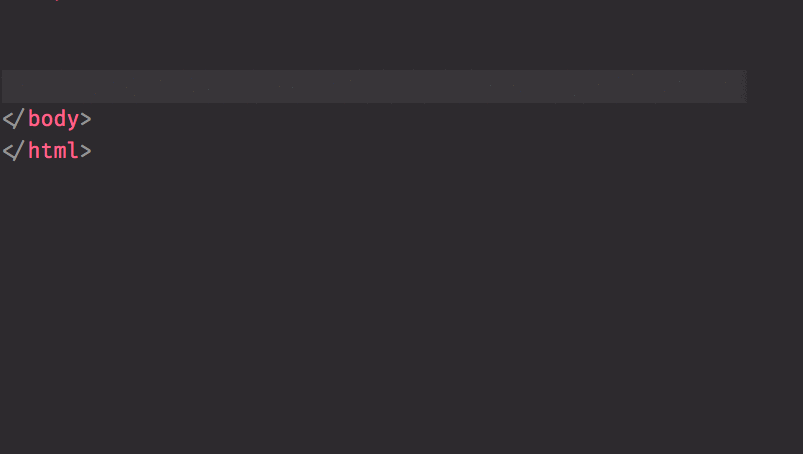

[Welcome](../../) > [Book 2 - The Invisible Web](../README.md) > HTML Dog - JavaScript

# HTML Dog - JavaScript Beginner Tutorial

In this next part of the project, you will continue to use the HTML Dog site, but now you will augment your HTML, and CSS with JavaScript. You will review many of the JavaScript concepts that you have already tried in the Foundations Course, but now as part of a larger project.

Be aware that the `<script>` element they ask you to create should be right _before_ the closing body tag in your HTML file.

Time to visit the HTML Dog [JavaScript Beginner Tutorial](https://www.htmldog.com/guides/javascript/beginner/) and finish the HTML Dog project.

| Previous Chapter | Next Chapter |
| :------------- |:-------------|
| [HTML Dog - CSS](./CSS_DOG.md) |  |
