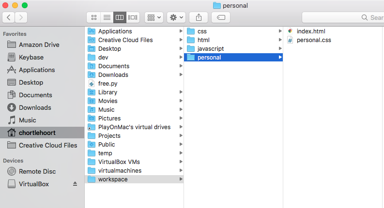

<nav>
  <ul class="list list--books">
    <li class="left">
        <span>Previous:</span> <a href="../book-3-the-invisible-web">Book 3 - The Invisible Web</a>
    </li>
    <li class="right">
        <span>Next:</span> Attend NSS
    </li>
  </ul>
</nav>


# Book 4 - The Terminal

> **IMPORTANT:** For the Foundations Course, when you see the words "terminal" or "command line", it means Git Bash for Windows users. For Mac users, it is the Terminal application.

In this book, you will learn how to use the terminal (also called the command line) to navigate your computer, execute helpful programs, and copy & move files and directories.

## Your Home Directory

Remember that you can always travel to your home directory by just typing in `cd` and pressing enter. You also use the `~` character to represent your home directory. For example, if you want to get to your workspace directory quickly, you can enter in the following command.

```sh
cd ~/workspace
```

## Creating Directories

`mkdir` is the command for creating directories. You may call these folders now, but when you are software developer, they are known as directories. Just `cd` to the directory in which you want to create a sub-directory and use that command. For example, if you want to create a `personal` directory in your workspace, you can enter in the following commands.

```sh
cd ~/workspace
mkdir personal
```

## Creating Files

The `touch` command is for creating files. For example, if you want to create an HTML file and a CSS file inside your `~/workspace/personal` directory, you can use the following commands.

```sh
cd ~/workspace/personal
touch index.html
touch personal.css
```

This is how it looks in Mac Finder. It would look similar in Windows File Explorer.



## Project Directory Structure

There are some standard directories that web developers creating when starting a project. Once the main directory is created, an HTML file is created in it. Then two sub-directories are created.

1. `css` to contain all the CSS files.
1. `scripts` to contain all the JavaScript files.

## Moving files in the terminal

The `mv` command moves files from one directory to another. For example, if you created the `personal.css` file in your `personal` directory, but want to move it into the `css` sub-directory, you would use the following commands. The pattern is `mv [file to move] [path to target directory]`.

```sh
cd ~/workspace/personal
mv personal.css css
```

## `.bashrc` intialization file

Earlier in the Foundations Course, we had you enter in a command in your terminal, but at the time you had no idea what was going on. Every time you start a new terminal application, your system looks for a file named `.bashrc` and runs all of the instructions inside of it.

Software developers use this file to set up help shortcuts and functions to help accelerate their workflow. Here's an example of something that a developer might do.

## Optional: Your First Bash Alias

> **TIP:** Bash aliases are a bit more advanced and require a small amount of comfort in the terminal. If you are still feeling shaky with terminal, feel free to skip this and come back later if you want.

In order to delete a directory, you need to precede the directory name with `rm -rf`. For example, if you want to delete the `personal` directory in your workspace, you would type in the following command.

```sh
cd ~/workspace
rm -rf personal
```

That may not seem like a big deal, but over time, typing in `rm -rf` is just awkward enough to make a developer want to type in something else in its stead. To do this you would create something called an alias. Let's alias the work `nuke` to mean `rm -rf`.

Type in the following command.

```sh
echo 'alias nuke="rm -rf"' >> ~/.bashrc
```

This appends some text to the end of the .bashrc file. You can see it if you type in `cat ~/.bashrc`. The `cat` command outputs the contents of a file. After typing that your should see the following output.

```sh
alias gs="git status"
alias nuke="rm -rf"
```

Now type in the following command to execute your initialization file and gain access to your new alias.

```sh
source ~/.bashrc
```

Next, create a directory and then use your alias to delete it.

```sh
cd ~/workspace
mkdir deleteme
nuke deleteme
```

## Learn enough command line to be dangerous

If you want to gain more in-depth knowledge about how to use the terminal on your computer, you can read the [Learn Enough Command Line to Be Dangerous](https://www.learnenough.com/command-line-tutorial/basics) online book from Michael Hartl.

> **Note:** For Windows users, some of the commands in the book may not work because the Git Bash program is not a true Unix terminal clone. All of the commands will work in the Mac Terminal application.

<br/>
<br/>
<br/>

---

## Related Links

<ul>
    <li>
        <a href="../">Welcome</a>
    </li>
    <li>
        <a href="../book-1-your-computer/">Book 1 - Getting Started</a>
    </li>
    <li>
        <a href="../book-2-the-visible-web/">Book 2 - The Visible Web</a>
    </li>
    <li>
        <a href="../book-3-the-invisible-web/">Book 3 - The Invisible Web</a>
    </li>
</ul>
